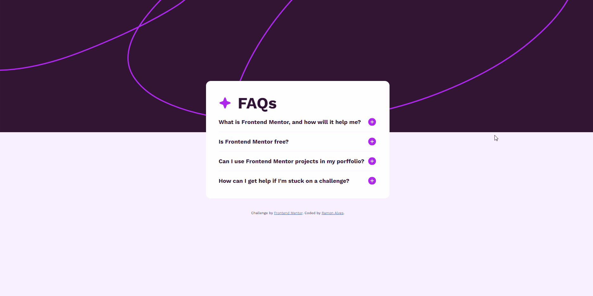

# Frontend Mentor - FAQ accordion solution

This is a solution to the [FAQ accordion challenge on Frontend Mentor](https://www.frontendmentor.io/challenges/faq-accordion-wyfFdeBwBz). Frontend Mentor challenges help you improve your coding skills by building realistic projects. 

## Table of contents 📖

- [Overview](#overview)
  - [The challenge](#the-challenge)
  - [Screenshot](#screenshot)
  - [Links](#links)
- [My process](#my-process)
  - [Built with](#built-with)
  - [What I learned](#what-i-learned)
  - [Continued development](#continued-development)
- [Author](#author)

## Overview 🔭

### The challenge 🏆

Users should be able to:

- Hide/Show the answer to a question when the question is clicked
- Navigate the questions and hide/show answers using keyboard navigation alone
- View the optimal layout for the interface depending on their device's screen size
- See hover and focus states for all interactive elements on the page

### Screenshot 🎴

#### Desktop Preview

#### Interactions and active states

#### Mobile Preview

### Links 🔗

- Solution URL: [GitHub Repository](https://github.com/Ramon-Alvez/FrontEnd-Mentor-FAQ-accordion)
- Live Site URL: [Site](https://ramon-alvez.github.io/FrontEnd-Mentor-FAQ-accordion/)

## My process 💻✒

### Built with 🧱🛠

- Semantic HTML5 markup
- CSS custom properties
- Flexbox

### What I learned 📚

I learned that even having done this before I still have difficulties with functions 😅

### Continued development 🚀

Now my plan is to practice JS with Frontend Mentor challenges and continue studying React

## Author 🧙‍♂️

- GitHub - [Ramon Alvez](https://github.com/Ramon-Alvez)
- Frontend Mentor - [@Ramon Alvez](https://www.frontendmentor.io/profile/Ramon-Alvez)
- LinkedIn - [@Ramon Alvez](https://www.linkedin.com/in/ramon-alvez/)